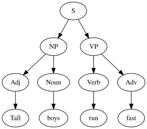

Lexing lab questions?

# Parsing 2.3

---

> Parsing or syntax analysis is the process of analyzing a string of symbols conforming to the rules of a formal grammar.

## Calculator Example

## Supported operations

- `1 + 2`
- `4 - 2`
- `2 * 3`
- `8 / 4`

## Goal

- Scan a string such as "1 + 2 \* 3" and determine if it is a valid operation, and order it so it can be executed.

## Chomsky Hierarchy

Grammar Automaton (Computer)

---

Unrestricted Turing Machines
Context Free Pushdown Automata
Regular Finite State Automata

## Context-free Languages

## Big Idea

- Grammar rules are applied recursively to generate members of the language.
- Grammar rules can be applied in reverse to parse a string to determine language membership.
- The parsing process can result in a parse tree showing token structure.

## English Example

- S -> NP VP
- NP -> Adj Noun
- NP -> Noun
- VP -> Verb Adv
- VP -> Verb

---

{height=540px}

## Implementing a parser

---

{height=540px}

## Top-down parsing

- Begins with overall structure (sometimes guessed or assumed) and then determines details
- Top-down refers to order in which nodes in the final parse tree are determined

---


{height=540px}

## Bottom-up parsing

- Determines low-level details first then builds our surrounding structure.

---

{height=540px}

## Shift-reduce parsing

- Bottom-up
- Shifts tokens onto a stack
- Reduces them when they match against a rule

## LR Parsing

- Shift-reduce, bottom-up parse
- Left-to-right, Rightmost derivation first
- Deterministic algorithm
- Linear time performance

## Calculator Grammar

- expr -> number
- expr -> expr operator expr

---

## Shift-Reduce Trace

Parsing "1 + 2"

```
Shift:  1
Reduce: (expr 1)
Shift:  +
Shift:  2
Reduce: (expr 2)
Reduce: (expr (expr 1) + (expr 2))
```

Result: `(expr (expr 1) + (expr 2))`
