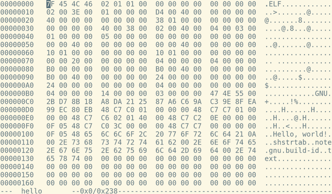

Programming Languages and Compilers
===================================

Introductions
-------------

- Who am I?
- What are you hoping to learn from this class?

Syllabus
--------

[Link](https://cpsc2430-programming-languages.netlify.com/)

Course Overview
===============


Introduction
------------

- 1.1 - 1.3 Why programming languages?
- 1.4 - 1.6 Compilation vs Interpretation

Foundations
-----------

- 2.1 - 2.2 Lexing (aka Tokenizing, Scanning)
- 2.3 - 2.5 Parsing - ASTs, Language Hierarchy
- 3.1 - 3.2 Binding and Lifetime
- 3.3 - 3.6 Scope and Closures
- 5 - Target Machine Architecture

Language Design
---------------

- 6 - Control Flow
- 7 - Type systems
- 8 - Composite Types
- 9 - Subroutines and Control Abstraction

Programming Paradigms
---------------------

- 10 - Object Oriented Programming (Python)
- 11 - Functional Programming (JS)
- 12 - Declarative Programming (SQL)

Course Server Information
=========================

Lovelace
--------

- Many programming languages and utilities are pre-installed
- If there are common tools that you'd like installed for everyone, let me know
- PRs for packages can also be submitted to [this file](https://github.com/jncraton/ubuntu-server-student-env/blob/master/envsetup)

Connection Details
------------------

- 10.73.56.26 (ssh)
- Initial passwords are "Password1"

Notes
-----

- The server should be stable, but I'm not running any backups and the server will be wiped at the end of the term.
- Your files in your home directory *should* be private, but please don't try to break into other students work.

Personal System Use
-------------------

You are welcome to use your personal system for any assignments, but I will not help with setting up environments beyond pointing you to official documentation.

Introduction
============

What is a computer?
-------------------

[A bunch of rocks](https://imgs.xkcd.com/comics/a_bunch_of_rocks.png)

History of Programming
----------------------

- 25th Century BC - Abacus (Babylon)
- 5th Century BC - Pāṇinian grammar (India)
- 1st Century BC - Antikythera mechanism (Greece)
- 12th Century - Castle Clock (Arab World)

---


---

> In Babbage's world his engines were bound by number...what Ada Byron saw—was that number could represent entities other than quantity. So once you had a machine for manipulating numbers, if those numbers represented other things, letters, musical notes, then the machine could manipulate symbols of which number was one instance

---


---

["Programming" scene from The Imitation Game](https://www.youtube.com/watch?v=pmEXNaWFGYQ&t=262s)

---


---


Why Languages?
--------------

---



---

```
objdump -d hello
```

```asm
hello:     file format elf64-x86-64

Disassembly of section .text:

00000000004000d4 <.text>:
  4000d4:	48 c7 c0 01 00 00 00 	mov    $0x1,%rax
  4000db:	48 c7 c7 01 00 00 00 	mov    $0x1,%rdi
  4000e2:	48 c7 c6 02 01 40 00 	mov    $0x400102,%rsi
  4000e9:	48 c7 c2 0e 00 00 00 	mov    $0xe,%rdx
  4000f0:	0f 05                	syscall 
  4000f2:	48 c7 c0 3c 00 00 00 	mov    $0x3c,%rax
  4000f9:	48 c7 c7 00 00 00 00 	mov    $0x0,%rdi
  400100:	0f 05                	syscall 
```

mov $0x1, %rax
-------------

### 48 c7 c0 01 00 00 00 	

- 48 - [REX prefix](https://wiki.osdev.org/X86-64_Instruction_Encoding)
- c7 - [mov instruction](http://ref.x86asm.net/coder64.html#xC7)
- c0 - register rax
- 01 00 00 00 - immediate value

---


16 x64 Registers
-------------

- RAX
- RBX
- RCX
- RDX
- RSI
- RDI
- RSP - Stack Pointer
- RBP - Base Pointer
- R8 - R15
