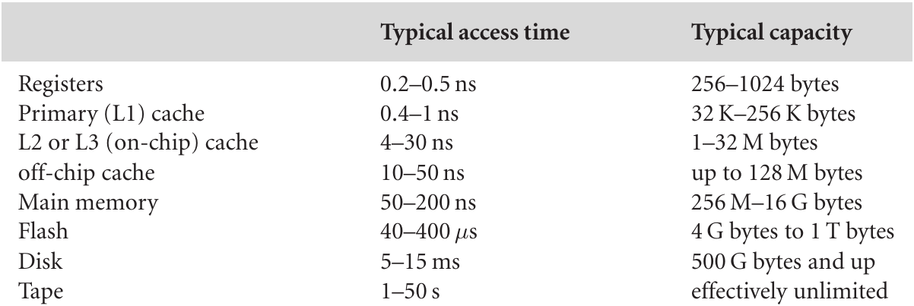
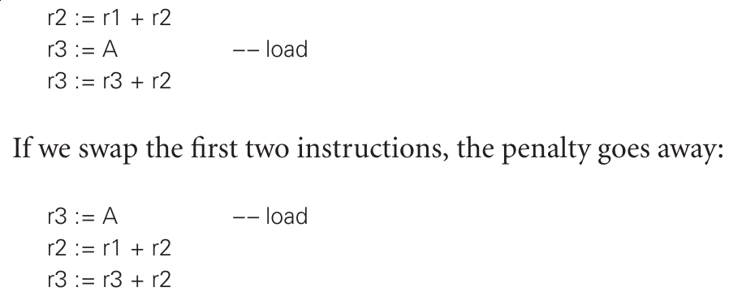

Exam Results
============

Programming Language Presentations
==================================

Target Machine Architecture
===========================

---

Much of programming language design involves the interplay between what we'd like our language to be able to do, and what the underlying hardware is able to do.

Compiling for Modern Processors (5.5)
-------------------------------------

---

CPU Pipelining
--------------

Pipeline stalls
---------------

- Cache misses - Data or intruction may not be immediately available
- Resource hazards - Two instructions may need the same functional unit
- Data hazards - An instruction may depend on a data value that hasn't yet been computed
- Control hazards - Branches may  depend on data that has not yet been computed

Hardware mitigations
--------------------

- Larger caches
- More functional units
- Out of order execution
- Branch prediction

Software mitigations
--------------------

- Restructuring control flow or data layout
- Instruction reording to minimize load delay

---

Dependencies
------------

- Flow (read-after-write) - Later instruction depends on output of earlier instruction
- Anti - (write-after-read) - Later instruction overwrites value read by earlier instruction
- Output (write-after-write) - Later instruction overwrites value written by earlier instruction

Mitigations
-----------

- Register renaming often resolves anti and output dependencies

---

[Register renaming](figures/5-16.png)

Register Allocation
-------------------

- Register usage strongly impacts performance
- Reorder becomes easier or harder
- Registers must be stored to RAM and reloaded after function calls
